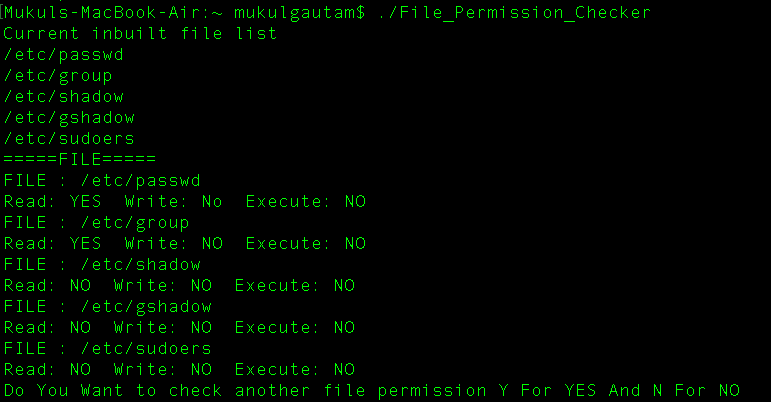
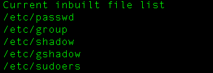
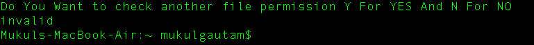
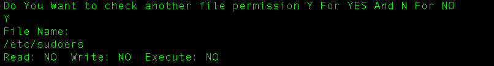
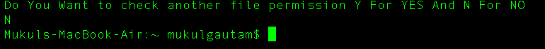

# FIle_Permission_Checker
During enumeration whenever we need to find out the permission on specific file apart from most common file on machine for credential hijacking.

whenever pentester enumerating the machine they always looking for the file with special permission or writable files so that they manipulate the code which ultimately helps them to get shell sometimes or reduce the steps to get to it.
I know it is not useful as we think, better scripts are already present but if you find anything useful it is appreciative.

# Usage
Its very simple just download the file script file and navigate to your downloaded folder where to place your downloaded file and just run `./File_Permission_Checker`

file checker already have some of the most common files if /etc/passwd if you like to modify or add new files you can directly add into the script

### Inbuilt list of file
- /etc/passwd
- /etc/group
- /etc/shadow
- /etc/gshadow
- /etc/sudoers

## Cases you may encounter
1. Invalid case: First case when your script asking if you wanna to check permission on new file in form of Y or N 

If you supply **Y** then just give the file name with full path as shown 

And if you didn't want to go futher then just quit but **N** 

